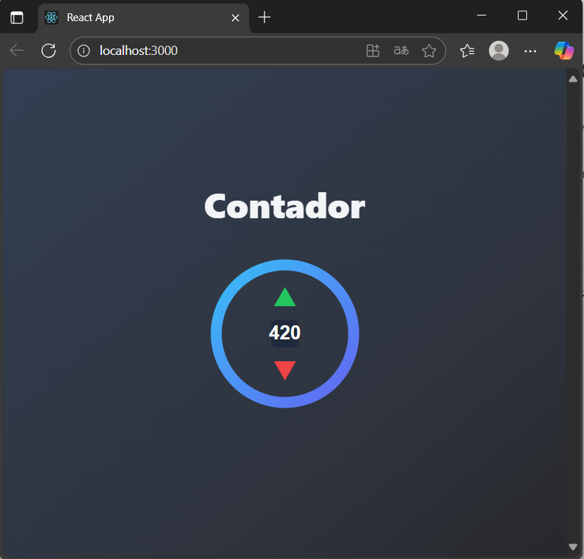

# 🔢 Contador con Logo Interactivo

Proyecto académico desarrollado con **React + Vite** y **Bulma**, que implementa un contador representado por un **logo SVG personalizado**.  
El contador permite incrementar o decrementar un valor haciendo clic en las flechas dentro del logo.

---

## 📸 Vista previa


---

## 🚀 Tecnologías utilizadas
- [React](https://react.dev/) – Librería para interfaces
- [Vite](https://vitejs.dev/) – Bundler rápido para desarrollo
- [Bulma](https://bulma.io/) – Framework CSS para estilos responsivos
- **SVG** – Gráficos vectoriales escalables para el logo

---

## 📂 Estructura del proyecto

```

src/
├── App.js          # Componente principal
├── Anillo.js       # Componente del logo/contador interactivo
├── main.jsx        # Punto de entrada con ReactDOM
└── index.css       # Estilos globales (Bulma importado)

````

---

## ⚙️ Instalación y uso

Clona el repositorio y entra a la carpeta:

```bash
git clone https://github.com/alejandronoriega12/contador.git
cd mi-contador-logo
````

Instala dependencias:

```bash
npm install
```

Ejecuta en modo desarrollo:

```bash
npm run dev
```

Abre en tu navegador:
👉 `http://localhost:3000`

---

## 🖱️ Uso del contador

* **Flecha verde (↑):** incrementa en `+1`
* **Flecha roja (↓):** decrementa en `-1`
* El valor se muestra en el centro del logo.

---

## 📖 Aprendizajes

* Integración de **React** con **SVGs interactivos**.
* Uso de **Bulma** para estructurar y dar estilo a la interfaz.
* Manejo de estado con **React Hooks (`useState`)**.
* Buenas prácticas de estructura en proyectos con **Vite**.

---

## 📜 Licencia

Este proyecto se realizó con fines **educativos**.
Puedes usarlo, modificarlo y adaptarlo libremente.

---
